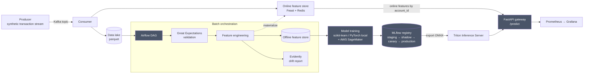

# Fraud Detection Pipeline

**Status: feature-complete — Sessions 0–11 in progress.** Full pipeline
built and live-verified end to end: dataset generation, Kafka ingestion,
Feast/Redis feature store, Airflow orchestration, local + SageMaker model
training, MLflow staged registry, Triton/FastAPI serving,
Prometheus/Grafana/Evidently monitoring, and a Docker Compose stack +
Kubernetes manifests + narrow Terraform module. Real, measured numbers are
below — no placeholders. One open item, stated plainly rather than buried:
serving latency misses the p99 < 50ms target under load (see
[Metrics](#metrics)); root cause is identified, fix is scoped for a future
session.

An end-to-end, portfolio-grade fraud detection system: streaming ingestion, a
feature store, orchestrated training, cloud-based training (SageMaker), a
model registry, real-time serving, monitoring/drift detection, and
containerized deployment.

Full requirements and rationale: [`PROJECT.md`](PROJECT.md).
Session-by-session build plan and logs: [`SESSIONS.md`](SESSIONS.md).

This is a synthetic dataset and system built for demonstration purposes —
it does not use or represent real financial data.

## Architecture



Deployed via Docker Compose (full stack, one command), Kubernetes manifests
(serving layer, tested against `kind`), and a Terraform module scoped
narrowly to the SageMaker + S3 pieces.

Four models are trained and compared: Logistic Regression (baseline), Random
Forest, Isolation Forest (unsupervised), and an LSTM (sequence-based).

## Repo layout

| Path | Purpose |
|---|---|
| `producer/` | Kafka producer replaying synthetic transactions as a live stream |
| `consumer/` | Kafka consumer writing to the data lake and feature store |
| `feature_store/` | Feast feature definitions (offline + online/Redis) |
| `dags/` | Airflow DAGs (ingest → validate → feature engineer → materialize) |
| `validation/` | Great Expectations checks run against each ingested batch |
| `training/` | Local and SageMaker model training code |
| `serving/` | Triton model repo + FastAPI gateway |
| `monitoring/` | Prometheus config, Grafana dashboards, Evidently reports |
| `infra/` | Terraform module (SageMaker training job resources only) |
| `k8s/` | Kubernetes manifests for the serving layer |
| `docs/` | Dataset docs, model comparison notes, registry promotion criteria |

## Quickstart

`docker-compose.yml` is now finalized (Session 10): a single command brings
up the entire stack (Kafka, Redis, Postgres, Airflow, MLflow, Triton, the
FastAPI gateway, Prometheus, Grafana), wired with `depends_on` +
healthchecks so services start in the correct order automatically.

Copy `.env.example` to `.env` first (fill in a generated Fernet key and
webserver secret key for Airflow -- see the comments in that file), then:

```bash
docker compose up -d
```

This assumes the dataset/model artifacts from earlier sessions already
exist on disk (`data/raw/*.parquet`, `feature_store/feature_repo/registry.db`,
`serving/model_metadata.json`, `serving/triton_model_repo/fraud_rf/1/model.onnx`)
-- see `docs/dataset.md`, `docs/feature_store.md`, and `docs/serving.md` for
how to (re)generate each from scratch on a truly clean checkout; these are
gitignored on purpose (large, regenerable, session-specific) rather than
committed.

Once healthy:

```bash
curl -X POST http://localhost:8090/predict -H "Content-Type: application/json" \
  -d '{"account_id":"acct_000000","amount":123.45,"merchant_category":"electronics"}'
```

Airflow UI: http://localhost:8080 (`admin` / whatever you set in `.env`).
Grafana: http://localhost:3000. MLflow: http://localhost:5000.

To replay synthetic transactions through the live Kafka pipeline:

```bash
python consumer/consume.py          # writes valid records to data/lake/, pushes features live
python producer/produce.py --limit 5000 --rate 200   # replays the dataset
```

See [`docs/kafka.md`](docs/kafka.md) for the message schema, offset/replay
strategy, and error-handling behavior; [`docs/feature_store.md`](docs/feature_store.md)
for how the Feast/Redis feature store keeps training and serving consistent;
[`docs/orchestration.md`](docs/orchestration.md) for the Airflow DAG;
[`docs/serving.md`](docs/serving.md) for the gateway and load-test results;
and [`docs/deployment.md`](docs/deployment.md) for the Session 10
Docker Compose / Kubernetes / Terraform writeup, including
[`k8s/README.md`](k8s/README.md) and [`infra/terraform/README.md`](infra/terraform/README.md).

## Metrics

Real, measured numbers — every one below was produced by an actual run of
the system, not estimated. Full detail and raw data in the linked docs.

### Dataset ([`docs/dataset.md`](docs/dataset.md))

| Metric | Value |
|---|---|
| Rows | 5,010,000 |
| Fraud rows | 10,000 (0.1996%) |
| Unique accounts | 50,000 |
| Engineered features | 15, all leakage-checked (no feature reads `is_fraud`) |
| Generation time | ~88s, single machine |

### Model comparison ([`docs/model_comparison.md`](docs/model_comparison.md))

Chronological 70/15/15 split; threshold picked on validation to target
recall ≥ 90% at FPR ≤ 2% (PROJECT.md's target), applied unchanged to test.
Accuracy is never reported — at a 0.2% fraud rate it's meaningless.

| Model | AUC-PR | Test recall | Test precision | Test F1 |
|---|---|---|---|---|
| Logistic Regression (baseline) | 0.312 | 78.6% | 7.9% | 0.144 |
| **Random Forest (production)** | **0.655** | 86.3% | 9.2% | 0.167 |
| Isolation Forest (unsupervised) | 0.050 | 52.0% | 4.3% | 0.080 |
| LSTM (sequence-based) | 0.641 | **88.1%** | 9.3% | 0.168 |

**Random Forest is the production model** — highest AUC-PR, currently
served via Triton (Session 7 registry promotion). LSTM edges it out on
recall (88.1% vs 86.3%) and was trained on a 10,000-account subsample
rather than the full 5M rows for local-GPU-time reasons; a full-scale
SageMaker retrain is scoped but deliberately deferred, not dropped (see
"What I'd do with more time"). **Honest gap:** neither model quite clears
the 90%-recall target from PROJECT.md at FPR ≤ 2% — closest is LSTM at
88.1%, reported as-is rather than rounded up.

### Serving latency ([`docs/serving.md`](docs/serving.md))

Real load test (Locust, `serving/locustfile.py`), 0 request failures at
every concurrency level tested:

| Concurrent users | RPS | p50 | p95 | p99 |
|---|---|---|---|---|
| 5 | 35.4 | 120ms | 170ms | 240ms |
| 50 | 60.6 | 490ms | 2,700ms | 4,200ms |
| 100 | 45.8 | 1,600ms | 5,400ms | 8,300ms |

**This misses PROJECT.md's target (p99 < 50ms @ 500 TPS) by a wide
margin — reported honestly, not hidden.** Root-caused via isolated
component benchmarks rather than guessing: Triton inference itself is
fast (p50 54ms, p99 145ms via a sync `requests` + thread pool — the
gateway's actual code path, chosen over `httpx.AsyncClient` specifically
because of a measured ~3.4x RPS difference on Windows). The real
bottleneck is Feast's Python client under concurrent load — p50 3.7ms but
p99 balloons to ~1000ms at 50 concurrent threads, a >250x tail-latency gap
pointing at contention inside Feast's `FeatureStore`, not Redis itself.
Fix is scoped (bypass Feast's client for the serving hot path, read the
same Redis keys directly) but not yet built.

### Drift detection ([`docs/monitoring.md`](docs/monitoring.md))

Live, end-to-end demo — not simulated — via a real Kafka replay:

1. Baseline drift check against the DAG's actual output: **14/29 columns
   drifted (48.3%), `drift_detected: False`**.
2. Replayed 5,000 transactions with `amount` scaled 5x
   (`producer/produce.py --amount-multiplier 5.0`) through the real Kafka
   topic → consumer → lake → Airflow DAG path.
3. Re-ran the DAG's drift task: **15/29 columns drifted (51.7%),
   `DRIFT DETECTED`** — `amount`'s own drift score jumped ~90x, the single
   column that tipped the aggregate over threshold.

### Grafana, under live load ([`docs/monitoring.md`](docs/monitoring.md))

50 concurrent users, 90s, 10,565 requests, 0 failures — dashboard's PromQL
queries confirmed returning real, moving numbers during the run (not just
wired up and hoped-for): 118.4 req/s final, p50/p95/p99 = 370/900/1200ms.

## What I'd do with more time

In priority order, each already scoped with a concrete fix, not a vague
aspiration:

1. **Fix the feature-engineering history bug** (`docs/monitoring.md`) —
   the Airflow DAG's `feature_engineering` task computes 6
   history-dependent features from only what's landed in the lake so far,
   not each account's true history, which both inflates the baseline
   drift number *and* corrupts the online Feast store on every DAG run.
   This is a real correctness bug, not just a demo artifact, and would be
   the first thing fixed in a follow-up session.
2. **Close the serving-latency gap** — bypass Feast's Python client on the
   `/predict` hot path and read the same Redis keys directly (format
   already documented in `feature_store/online_features.py`); re-measure
   on Linux, since two of the three latency findings are plausibly
   Windows-specific (`ProactorEventLoop`, Feast contention).
3. **Retrain the LSTM at full scale via SageMaker** — currently trained
   on a 10,000-account (~1M row) subsample for local-GPU-time reasons; it
   already edges out Random Forest on recall (88.1% vs 86.3%) at a fifth
   of the data, and is the more fraud-relevant metric per PROJECT.md's own
   target.
4. **Hyperparameter search** — every model currently runs a single fixed
   config; Random Forest depth/leaf-size and LSTM hidden-size/sequence
   length are reasonable defaults, not tuned ones.
5. **Drift alerting**, not just logging — wire `drift_detected=True` into
   Prometheus Alertmanager or an Airflow callback, deliberately deferred
   as out of scope for a first "report, not a gate" pass.

## Cost

The one paid piece (AWS SageMaker training) stayed inside PROJECT.md's
guardrails: no endpoint was ever left running, training used free-tier-eligible
instance types, and a final audit (2026-08-10) across `us-east-1`,
`us-west-2`, `ap-southeast-2` confirmed zero SageMaker endpoints, notebook
instances, or in-progress training jobs anywhere. The one S3 bucket from
Session 6 (~326MB: training data + one training job's source bundle) has a
14-day expiration lifecycle rule on the training-data prefix. Everything
else (Kafka, Feast, Redis, Airflow, MLflow, Triton, Prometheus, Grafana,
Docker, Kubernetes) runs entirely self-hosted at zero cost.
