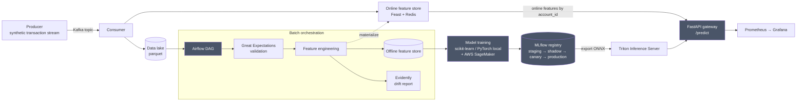

# Fraud Detection Pipeline

An end-to-end fraud detection system: streaming ingestion, a feature store,
orchestrated and cloud-based model training, a model registry, real-time
serving, and drift monitoring, all containerized and runnable with one
command.

Full requirements and design rationale: [`PROJECT.md`](PROJECT.md).

This project uses a synthetic dataset built for demonstration. It does not
use or represent real financial data.

**Status:** feature-complete. All components are built and verified against
a live run of the stack. One known gap: serving latency misses its p99
target under load (see [Results](#results)); root cause is identified and
the fix is scoped for a future update.

## Architecture



Four models are trained and compared: Logistic Regression (baseline),
Random Forest, Isolation Forest (unsupervised), and an LSTM
(sequence-based). Random Forest is currently in production.

Deployed with Docker Compose (full local stack), Kubernetes manifests
(serving layer, tested with `kind`), and a Terraform module scoped to the
SageMaker and S3 resources only.

## Repo layout

| Path | Purpose |
|---|---|
| `producer/` | Kafka producer replaying synthetic transactions as a live stream |
| `consumer/` | Kafka consumer writing to the data lake and feature store |
| `feature_store/` | Feast feature definitions (offline + online/Redis) |
| `dags/` | Airflow DAGs (ingest, validate, feature engineer, materialize) |
| `validation/` | Great Expectations checks run against each ingested batch |
| `training/` | Local and SageMaker model training code |
| `serving/` | Triton model repo + FastAPI gateway |
| `monitoring/` | Prometheus config, Grafana dashboards, Evidently reports |
| `infra/` | Terraform module (SageMaker training job resources only) |
| `k8s/` | Kubernetes manifests for the serving layer |
| `docs/` | Dataset docs, model comparison, deployment and serving writeups |

## Quickstart

`docker-compose.yml` brings up the full stack (Kafka, Redis, Postgres,
Airflow, MLflow, Triton, the FastAPI gateway, Prometheus, Grafana) with
healthchecks and `depends_on` so services start in the correct order.

Copy `.env.example` to `.env` (see the comments in that file for the
Airflow secrets it needs), then:

```bash
docker compose up -d
```

This assumes the dataset and model artifacts already exist on disk
(`data/raw/*.parquet`, `feature_store/feature_repo/registry.db`,
`serving/model_metadata.json`,
`serving/triton_model_repo/fraud_rf/1/model.onnx`). These are gitignored
on purpose (large and regenerable). See `docs/dataset.md`,
`docs/feature_store.md`, and `docs/serving.md` for how to generate each
from scratch.

Once healthy:

```bash
curl -X POST http://localhost:8090/predict -H "Content-Type: application/json" \
  -d '{"account_id":"acct_000000","amount":123.45,"merchant_category":"electronics"}'
```

Airflow: http://localhost:8080. Grafana: http://localhost:3000. MLflow:
http://localhost:5000.

To replay synthetic transactions through the live Kafka pipeline:

```bash
python consumer/consume.py          # writes valid records to data/lake/, pushes features live
python producer/produce.py --limit 5000 --rate 200   # replays the dataset
```

Further detail: [`docs/kafka.md`](docs/kafka.md) (message schema, replay
strategy), [`docs/feature_store.md`](docs/feature_store.md) (Feast/Redis
setup), [`docs/orchestration.md`](docs/orchestration.md) (the Airflow DAG),
[`docs/serving.md`](docs/serving.md) (gateway and load-test results), and
[`docs/deployment.md`](docs/deployment.md) (Compose/Kubernetes/Terraform).

## Results

Every number below comes from an actual run of the system. Full detail in
the linked docs.

### Dataset

| Metric | Value |
|---|---|
| Rows | 5,010,000 |
| Fraud rows | 10,000 (0.1996%) |
| Unique accounts | 50,000 |
| Engineered features | 15 |

### Model comparison

Chronological 70/15/15 split. Threshold selected on validation, applied
unchanged to test. Accuracy is not reported: at a 0.2% fraud rate it is
not a meaningful metric.

| Model | AUC-PR | Test recall | Test precision | Test F1 |
|---|---|---|---|---|
| Logistic Regression (baseline) | 0.312 | 78.6% | 7.9% | 0.144 |
| **Random Forest (production)** | **0.655** | 86.3% | 9.2% | 0.167 |
| Isolation Forest (unsupervised) | 0.050 | 52.0% | 4.3% | 0.080 |
| LSTM (sequence-based) | 0.641 | **88.1%** | 9.3% | 0.168 |

Random Forest is in production for the highest AUC-PR. The LSTM has a
slightly higher recall but was trained on a 10,000-account subsample; a
full-scale retrain via SageMaker is on the roadmap. Neither model yet
clears the 90% recall target at FPR ≤ 2% defined in `PROJECT.md`; closest
is the LSTM at 88.1%.

### Serving latency

Locust load test, `serving/locustfile.py`. Zero request failures at every
concurrency level tested.

| Concurrent users | RPS | p50 | p95 | p99 |
|---|---|---|---|---|
| 5 | 35.4 | 120ms | 170ms | 240ms |
| 50 | 60.6 | 490ms | 2,700ms | 4,200ms |
| 100 | 45.8 | 1,600ms | 5,400ms | 8,300ms |

This misses the p99 < 50ms target from `PROJECT.md`. Component-level
benchmarks isolated the cause: Triton inference itself is fast (p99
145ms), the bottleneck is Feast's client under concurrent load (p99
balloons to roughly 1000ms at 50 threads). Detail and the full
investigation: [`docs/serving.md`](docs/serving.md).

### Monitoring and drift detection

Prometheus and Grafana track request rate, latency percentiles, and
fraud-flag rate for the serving layer. Evidently runs a drift check in the
Airflow DAG on a schedule.

The drift check was verified live: a baseline batch showed 14/29 columns
drifted (48.3%, not flagged). After replaying 5,000 transactions with
`amount` scaled 5x through the real Kafka pipeline, the same check flagged
15/29 columns (51.7%, `DRIFT DETECTED`). Detail:
[`docs/monitoring.md`](docs/monitoring.md).

## Roadmap

1. Fix a feature-engineering bug where history-dependent features are
   computed from only the current batch instead of each account's full
   history. This affects the online feature store's correctness, not just
   the drift baseline.
2. Close the serving-latency gap by reading Redis directly on the hot
   path instead of through Feast's client.
3. Retrain the LSTM at full scale via SageMaker.
4. Hyperparameter search for Random Forest and the LSTM (currently fixed
   configs).
5. Alert on drift detection instead of only logging it.

## Cost

The only paid component, AWS SageMaker training, stayed within budget: no
endpoint was left running, and a resource audit across three regions
confirmed zero active SageMaker endpoints, notebooks, or training jobs.
Everything else (Kafka, Feast, Redis, Airflow, MLflow, Triton, Prometheus,
Grafana, Docker, Kubernetes) runs self-hosted at zero cost.
