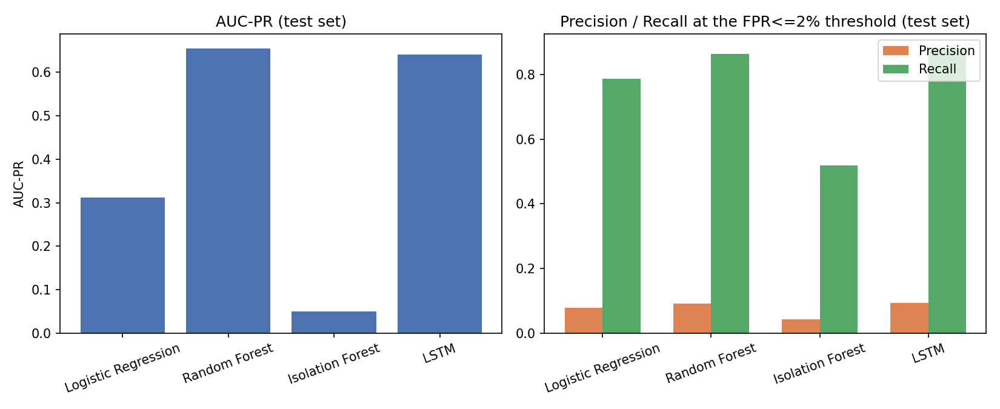

# Model Comparison — Session 5

All 4 models were trained on a **chronological** train/val/test split
(70/15/15 by timestamp span, not row count) of the synthetic transaction
dataset (see `docs/dataset.md`) -- no future transactions leak into
training. The classification threshold for each model was selected on the
**validation** set to hit the target false-positive rate from
PROJECT.md #6 (recall >= 90% at FPR <= 2%), then applied unchanged to the
held-out **test** set to produce the precision/recall/F1 numbers below.
AUC-PR is threshold-independent and computed directly on test. Plain
accuracy is not reported anywhere, deliberately -- at a ~0.2% fraud rate
it would be >99% for a model that never flags anything.

Class imbalance is handled via **class weighting**, not SMOTE, for every
model -- see the "Imbalance strategy" column below and the training
scripts (`training/train_*.py`) for the per-model mechanism and rationale.

## Results

| Model | AUC-PR | Precision | Recall | F1 | Recall @ FPR<=2% (val) | Threshold | Train time (s) | Imbalance strategy |
|---|---|---|---|---|---|---|---|---|
| Logistic Regression | 0.3120 | 0.0790 | 0.7858 | 0.1435 | 0.7911 | 0.8168 | 6.8 | class_weight=balanced |
| Random Forest | 0.6554 | 0.0924 | 0.8628 | 0.1669 | 0.8802 | 0.3728 | 614.6 | class_weight=balanced_subsample |
| Isolation Forest | 0.0497 | 0.0434 | 0.5197 | 0.0801 | 0.5128 | -0.0621 | 27.5 | unsupervised, contamination set from train fraud rate |
| LSTM | 0.6413 | 0.0927 | 0.8812 | 0.1678 | 0.8468 | 0.7664 | 35.7 | pos_weight=489.1 in BCEWithLogitsLoss |

*(Numbers above are pulled live from MLflow by `training/compare_models.py`
-- rerun it after retraining to refresh this table.)*

## Recommendation

**Random Forest** is the recommended production candidate: it has
the highest AUC-PR (0.6554) of the 4 models, which
matters more than any single-threshold metric here since AUC-PR summarizes
ranking quality across the full precision/recall tradeoff -- the threshold
actually deployed can still be tuned independently at serving time (and
will be, formally, in Session 7's staged rollout).

LSTM achieves the highest recall at the FPR<=2% operating
point (0.8812), which is the more relevant number if
the deployment goal is "catch as much fraud as possible within a fixed
false-positive budget" rather than overall ranking quality -- worth
revisiting once real (non-synthetic) traffic and a real cost-of-a-false-
positive number are available.

Isolation Forest's numbers reflect that it never sees `is_fraud` during
training (contamination is set from the training split's fraud rate, not
learned) -- it's included as the unsupervised anomaly-detection baseline
PROJECT.md calls for, not because it's expected to beat the 3 supervised
models on this labeled dataset.

## What I'd try with more time

- Hyperparameter search (currently single fixed configs per model) --
  particularly Random Forest depth/leaf-size and the LSTM's hidden size /
  sequence length, both chosen as reasonable defaults rather than tuned.
- Train the LSTM on the full 5M-row dataset rather than the 10,000-account
  (~1M row) subsample used here (a deliberate local-GPU scale tradeoff,
  documented in `training/train_lstm.py`) -- likely via SageMaker in
  Session 6, which is exactly the kind of workload a managed training job
  is for.
- An explicit padding mask for the LSTM's left-padded short sequences,
  instead of relying on the network to learn to ignore normalized-zero
  padding steps.
